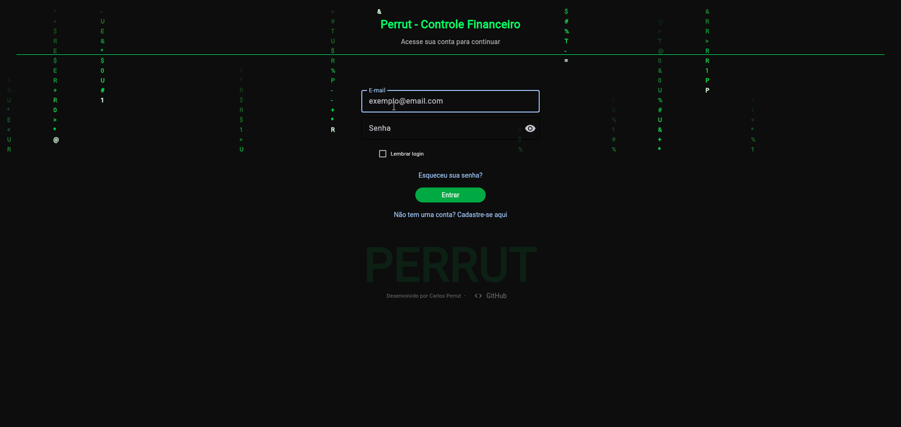
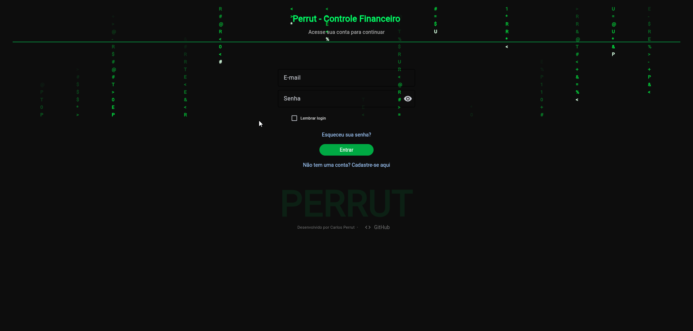
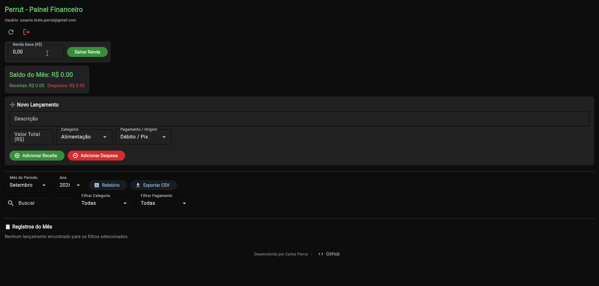
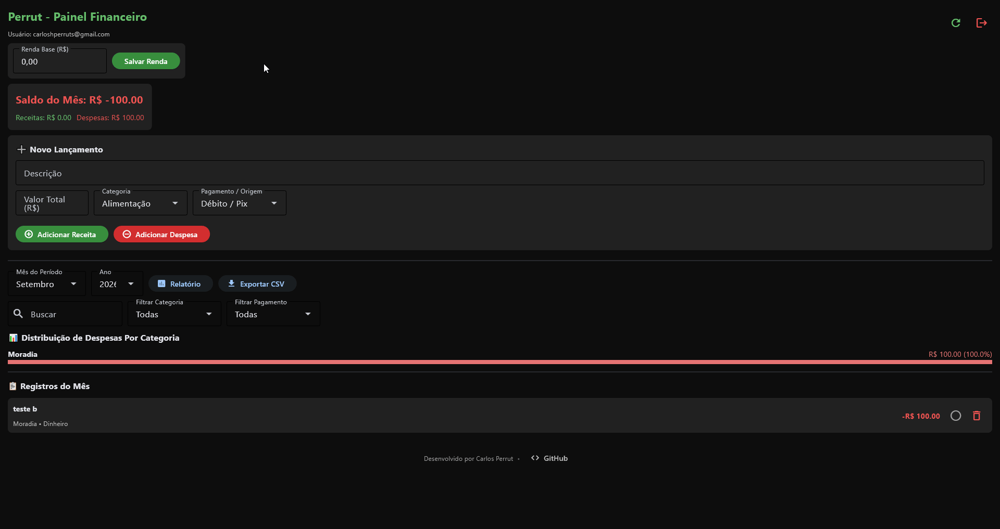

# 💰 Perrut - Controle Financeiro

Sistema web e desktop de controle financeiro pessoal desenvolvido em **Python**, com autenticação de usuários, persistência em banco de dados na nuvem e exportação de relatórios.

O projeto nasceu de uma necessidade real: organizar minhas próprias finanças. A partir daí, virou um estudo prático de arquitetura de software — separação de responsabilidades (views, config, utils), autenticação segura, integração com banco de dados externo e tratamento de erros em operações assíncronas.

---

## 📸 Demonstração

**Preview geral (versão atual)**


**Tela de Login**


**Dashboard principal**


**Exportação de relatório CSV**


---

## ✨ Funcionalidades

- 🔐 **Login, cadastro e recuperação de senha** via Supabase
- 💾 **Persistência de sessão local** (opção "lembrar login")
- ➕ **Cadastro de receitas e despesas**, com categoria, forma de pagamento e status de pagamento
- 📊 **Totais automáticos** por categoria e por tipo (receita/despesa)
- 📈 **Gráfico visual** dos gastos por categoria
- 🗂️ **Filtros por mês e ano**
- 📄 **Exportação de relatórios em CSV**
- 🧾 **Relatório mensal detalhado**
- 🖥️ Interface construída com **Flet** (Python + Flutter), rodando tanto como **app desktop** quanto como **aplicação web** (`python main.py --web`)

---

## 🛠️ Tecnologias utilizadas

- [Python](https://www.python.org/)
- [Flet](https://flet.dev/) — construção da interface gráfica
- [Supabase](https://supabase.com/) — autenticação e banco de dados
- [Matplotlib](https://matplotlib.org/) — geração de gráficos
- [python-dotenv](https://pypi.org/project/python-dotenv/) — variáveis de ambiente

---

## 🧩 Desafios e aprendizados

Mais do que decisões de arquitetura pensadas de antemão, o maior desafio deste projeto foi testar o app de ponta a ponta, encontrar os erros que só aparecem em uso real e ajustar o código a partir disso. Alguns exemplos concretos:

- **Falha silenciosa de renderização (tela cinza):** combinar `wrap=True` num `ft.Row` com filhos `expand=True` gerava um crash do lado do Flutter sem nenhum erro no terminal Python. Foi preciso isolar o problema com scripts de teste progressivos (do mínimo até reproduzir a falha) até identificar a incompatibilidade e resolver trocando `expand=True` por larguras fixas.
- **Sessão local com auto-login:** o app salva os tokens de sessão localmente e tenta reautenticar automaticamente ao abrir, com fallback seguro para a tela de login caso a sessão esteja expirada ou inválida — sem travar a aplicação.
- **Exportação assíncrona:** o download de CSV inicialmente travava por um descompasso entre chamada síncrona e assíncrona; resolvido encapsulando a chamada com `asyncio.create_task`, além de tratar caminhos de arquivo de forma diferente para desktop (`file:///`) e web.
- **Exportação de CSV com encoding correto:** ajustei o delimitador (`;`) e a codificação do arquivo exportado para abrir corretamente no Excel em português, evitando o problema comum de acentuação quebrada em CSVs gerados por Python.
- **Variáveis de ambiente para credenciais:** `SUPABASE_URL` e `SUPABASE_KEY` nunca ficam hardcoded; o app falha de forma explícita (`RuntimeError`) se as variáveis não estiverem configuradas, em vez de falhar silenciosamente.
- **Operações assíncronas:** chamadas à API do Supabase rodam em thread separada (`asyncio.to_thread`) para não travar a interface enquanto os dados carregam.

---

## 🚀 Como rodar o projeto localmente

### Pré-requisitos
- Python 3.10 ou superior instalado
- Uma conta gratuita no [Supabase](https://supabase.com/) com um projeto criado

### Passo a passo

```bash
# 1. Clone o repositório
git clone https://github.com/seu-usuario/seu-repositorio.git
cd seu-repositorio

# 2. Crie um ambiente virtual (recomendado)
python -m venv venv
venv\Scripts\activate      # Windows
source venv/bin/activate   # Linux/Mac

# 3. Instale as dependências
pip install -r requirements.txt
```

Crie um arquivo `.env` na raiz do projeto com suas próprias credenciais do Supabase:

```env
SUPABASE_URL=sua_url_aqui
SUPABASE_KEY=sua_chave_aqui
```

> ⚠️ O arquivo `.env` nunca deve ser enviado ao GitHub. Ele já está listado no `.gitignore` deste projeto.

Por fim, rode o projeto:

```bash
python main.py          # abre como app desktop
python main.py --web    # abre no navegador, como aplicação web
```

---

## 📁 Estrutura do projeto

```
├── main.py                  # Ponto de entrada da aplicação
├── config/
│   └── supabase_client.py   # Conexão com Supabase e categorias padrão
├── views/
│   ├── login_view.py        # Tela de login, cadastro e recuperação de senha
│   ├── dashboard_view.py    # Lógica e estado do dashboard
│   └── dashboard_ui.py      # Montagem dos componentes visuais do dashboard
├── components/
│   └── matrix_bg.py         # Componentes visuais reutilizáveis
├── utils/
│   └── helpers.py           # Funções auxiliares (sessão, exportação CSV, etc.)
├── assets/
│   └── exports/             # Relatórios exportados
└── requirements.txt         # Dependências do projeto
```

---

## 🧠 Sobre o desenvolvimento

Este projeto é resultado de aprendizado autodidata, combinando estudo próprio com apoio de ferramentas de IA (Gemini e Claude) para acelerar pesquisa, revisar código e entender conceitos novos — da mesma forma que qualquer desenvolvedor hoje usa documentação, fóruns e pair programming. As decisões de arquitetura, a modelagem dos dados e a resolução de bugs de produção (autenticação, encoding de arquivos, tratamento de exceções) foram feitas e validadas por mim.

Estou em transição de carreira para desenvolvimento de software e busco oportunidades como estagiário ou desenvolvedor júnior. Feedback técnico é muito bem-vindo — se você é recrutador ou desenvolvedor e tiver sugestões sobre o código, fico feliz em conversar.

---

## 🔜 Próximos passos

- [ ] Melhorias e correções contínuas conforme bugs forem identificados no uso real
- [ ] Testes para validar o funcionamento das funcionalidades existentes
- [ ] Atualizações incrementais trazendo pequenos ajustes e melhorias ao longo do tempo

---

## 📬 Contato

**Desenvolvido por:** Carlos Perrut
**E-mail:** carloshperruts [at] gmail [dot] com
**LinkedIn:** [linkedin.com/in/carlos-henrique-perrut](https://www.linkedin.com/in/carlos-henrique-perrut)
**GitHub:** [github.com/carloshperruts](https://github.com/carloshperruts)

---

## 📄 Licença

Projeto pessoal para fins de estudo e portfólio.
